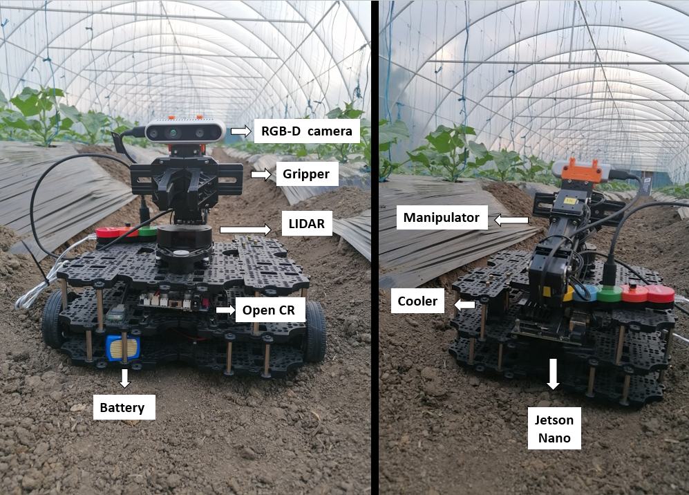

# Autonomous Harvesting Robot Prototype

## pwd by Turtlebot3 + nVidia Jetson + OpenManipulator
 
[]

Autonomous robots, computer vision and AI controlled applications are getting higher influence
in our everyday life. Similarly, in the case of precision agriculture is the same, where the help
of these robots could conduct a more efficient but also greener way of food production. 

> 'The main goal of this project is to develop a robotic platform which is capable of carrying out
agricultural activities, by integrating technological advances from the last years. The project
is based on a mobile robotic platform equipped with a robotic arm and a depth camera, connected
to an embedded computer. ROS is used to control the robot and AI algorithms are used to provide
autonomy.'

~ intro of my license thesis.

This project was my Bachelor's License (BSc) project in Computer Science & Automation at the Technical
University of Cluj-Napoca, and I managed to won the 2022 edition of the
[CSSC](https://cs.utcluj.ro/cssc-2022.html) conference organized by BBU and TUCN.

## Table of Contents

- [Prerequisites](#prerequisites)
- [Install](#install)
- [Usage](#usage)
	- [Generator](#generator)
- [Badge](#badge)
- [Example Readmes](#example-readmes)
- [Related Efforts](#related-efforts)
- [Maintainers](#maintainers)
- [Contributing](#contributing)
- [License](#license)

## Prerequisites

The project is based on the [Robot Operaing System's](https://www.ros.org/)  [Melodic Distro](http://wiki.ros.org/melodic).
One should start with the installation steps provided by the ROS platform. The recommended OS is
[Ubuntu 18.04](https://releases.ubuntu.com/18.04/) for the Master PC and [JetPack 4.6] for the Jetson Nano since
it has been tested only in this configuration, but it should be working fine on other Linux-based systems too.

On the Hardware side, I was working with a [Jetson Nano Dev Kit](https://developer.nvidia.com/embedded/jetson-nano-developer-kit)
used for controlling the robotic platform, which is a [Turtlebot3 Waffle](https://emanual.robotis.com/docs/en/platform/turtlebot3/overview/)
completed by the [OpenManipulator-X](https://emanual.robotis.com/docs/en/platform/openmanipulator_x/overview/) robotic arm. In addition,
I use an [Intel Realsense D435i Depth Camera](https://www.intelrealsense.com/depth-camera-d435i/) for customized object detection and
getting the object's coordinates in 3D space.

The robot and its parts illustrated on the testing scene:


## Install

### D435i Depth Camera

For using the camera one should install the realsense2 SDK's ROS Wrapper by typing:

```sh
$ sudo apt-get install ros-$ROS_DISTRO-realsense2-camera
```

> **_NOTE:_**  Because of the introduction of ROS2, the ROS1 has recently been deprecated, and tnstallation links may get too for ROS1.

Unfortunately, in case of the ARM arhictectures this installer does not work, so one has to build both the ROS package from source, detailed
guide can be found on the [ROS wrapper's](https://github.com/IntelRealSense/realsense-ros/tree/ros1-legacy) page.

Moreover, the [Python wrapper](https://pypi.org/project/pyrealsense2/) for the Intel RealSense SDK2.0 is also needed, which provides C++
to Python binding.

```sh
$ pip install pyrealsense2
```

> **_NOTE:_**  In case of the SDK's Python wrapper the situation is the same (if it has not been resolved in the meantime) it does not work with the ARM processors, therefore we need to build it from source:

```sh
$ git clone https://github.com/IntelRealSense/librealsense.git
$ cd librealsense
$ mkdir build
$ cd build
$ cmake ../ -DBUILD_PYTHON_BINDINGS:bool=true -DBUILD_WITH_CUDA:bool=true
$ make -j4
$ sudo make install
```
After building the Python wrapeer for the Realsense SDK2.0 from source we need to update the ... 
```sh
$ cd ~/librealsense
$ ./scripts/setup_udev_rules.sh
```

Next, we need to add the following lines to .bashrc file:

```sh
sudo nano ~/.bashrc
export PATH=$PATH:~/.local/bin
export PYTHONPATH=$PYTHONPATH:/usr/local/lib
export PYTHONPATH=$PYTHONPATH:/usr/local/lib/python3.6/pyrealsense2
```

### ROS Master-Slave with Jetson Nano

In case of the Turtlebot the most common method to control your robot is to use a master-slave configuration. The ROS Master helps individual nodes to communicate with each other peer-to-peer, therefore it is also used for the communication of multiple robots. In case of the Jetson Nano, it does not have RTC backup power supply the clock will be reseted after powering off. If it does not have an ethernet/internet connection it won't know the current date and time, but in many cases even having the internet connection it just simply did not synchronize with current time. On the other hand, the remote PC and the Jetson have to be synchronized somehow, otherwise there could be problems in the communication (at least in case of the OpenManipulator controller). There could be multiple solutions, like [this](https://github.com/justsoft/jetson-nano-date-sync) but I have used [chrony](https://chrony.tuxfamily.org/)

On our **remote PC**:

```sh
sudo apt-get install chrony
sudo nano /etc/chrony/chrony.conf
```

At the end of your chrony.conf file put the following, be aware of using the correct IP:
```sh
# make it serve time even if it is not synced (as it can't reach out)
local stratum 8
# allow the IP of your peer to connect
allow <IP of your time-clinet>
```

On our **Jetson Nano** the steps are similar:
```sh
sudo apt-get install chrony
sudo nano /etc/chrony/chrony.conf
```
Then we have to add the following line:
```sh
server <server_ip> minpoll 0 maxpoll 5 maxdelay .05
```

And it should work in the following. Source: I found this provided by lorenznew [here](https://answers.ros.org/question/298821/tf-timeout-with-multiple-machines/?answer=298908#post-id-298908)

## Usage

There are going to be shown multiple use-cases here, in which the arm could be used. Now, just a short description about how to launch the robot and use together with the arm. 

First on our **Remote PC** we should start running the roscore

```sh
roscore
```

Next in a new terminal window, we should connect to our **Jetson Nano, to bring up the Waffle** using:

```sh
ssh name_of_jetson@wlan_ip_of_jetson
roslaunch turtlebot3_bringup turtlebot3_robot.launch
```

### Mapping

For mapping the environment the SLAM node is launched and an RVIZ illustration of the environment is shown:

```sh
roslaunch turtlebot3_slam turtlebot3_slam.launch
```

Launching the teleoperation node to control the robot:

```sh
roslaunch turtlebot3_teleop turtlebot3_teleop_key.launch
```

The operator has to guide the robot through the envirnment, and has to **Publish a point** at the target
location and at the starting position, and saving them by echoing the published points:

```sh
rostopic echo /clicked_point
```

Save the map and close every node:

```sh
rosrun map_server map_saver -f ~\map_name
```

### Navigation


For instance, for controlling the robotic arm, in the next phase we should make a connection **(bringup) the arm on our Remote PC**, by running the following command in a new terminal window:

```sh
roslaunch turtlebot3_manipulation_bringup turtlebot3_manipulation_bringup.launch
``` 
Note: here I've made some changes to be able to control the arm using ROS Melodic.

In the following step, I am using [MoveIt!](http://docs.ros.org/en/melodic/api/moveit_tutorials/html/index.html) to control the arm. For this, you can get ..., and we can launch the rviz and controller using:

```sh
roslaunch open_manipulator_controllers joint_trajectory_controller.launch sim:=false
```

https://answers.ros.org/question/196586/how-do-i-disable-execution_duration_monitoring/


### Generator

To use the generator, look at [generator-standard-readme](https://github.com/RichardLitt/generator-standard-readme). There is a global executable to run the generator in that package, aliased as `standard-readme`.

## Badge

If your README is compliant with Standard-Readme and you're on GitHub, it would be great if you could add the badge. This allows people to link back to this Spec, and helps adoption of the README. The badge is **not required**.

[](https://github.com/RichardLitt/standard-readme)

To add in Markdown format, use this code:

```
[](https://github.com/RichardLitt/standard-readme)
```

## Example Readmes

To see how the specification has been applied, see the [example-readmes](example-readmes/).

## Related Efforts

- [Art of Readme](https://github.com/noffle/art-of-readme) - 💌 Learn the art of writing quality READMEs.
- [open-source-template](https://github.com/davidbgk/open-source-template/) - A README template to encourage open-source contributions.

## Maintainers


## Contributing

Feel free to dive in! [Open an issue](https://github.com/RichardLitt/standard-readme/issues/new) or submit PRs.

Standard Readme follows the [Contributor Covenant](http://contributor-covenant.org/version/1/3/0/) Code of Conduct.

### Contributors


## License

[MIT](https://en.wikipedia.org/wiki/MIT_License) © Köllő Magor Örs, TUCN, 2022.
